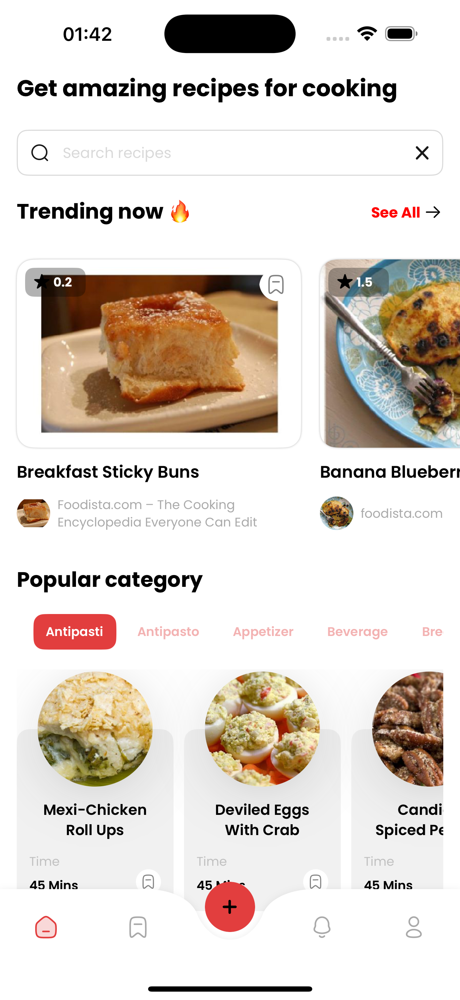
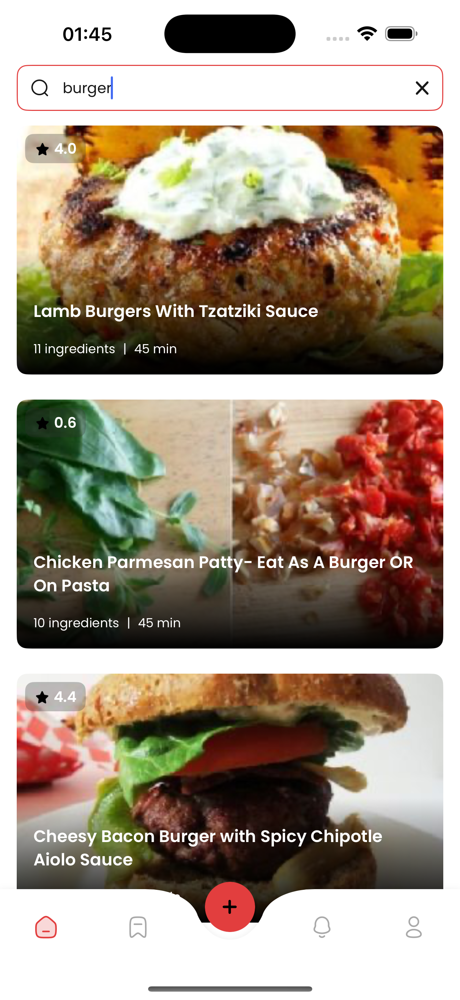
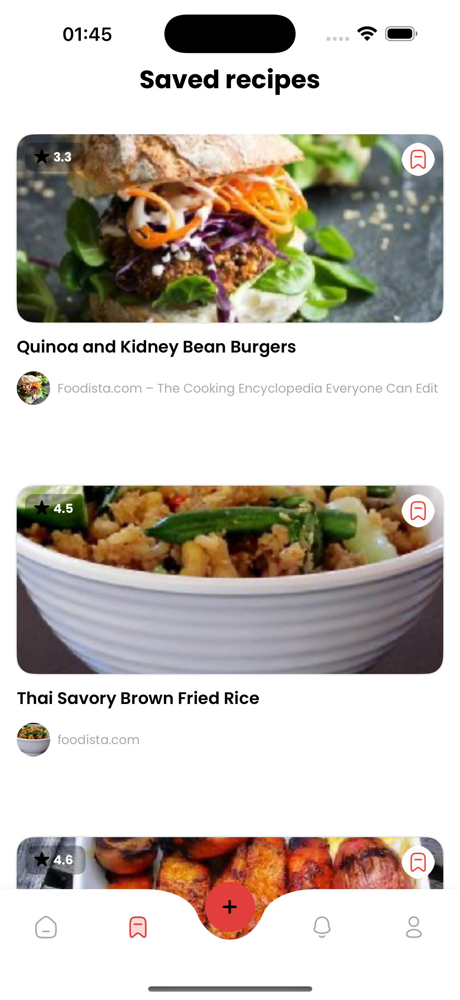

# 🍳 BestRecipes — find, save, cook

<div align="center">


</div>

<div align="center">

**Recipe discovery app with search and favorites. DevRush Project 2.**

</div>

## 🖼️ Screens

<style>
.screens-showcase {
  display: flex;
  justify-content: center;
  align-items: center;
  gap: 20px;
  margin: 50px 0;
  flex-wrap: wrap;
  perspective: 1200px;
  min-height: 500px;
}

.screen {
  width: 190px;
  height: 380px;
  border-radius: 30px;
  box-shadow: 0 15px 50px rgba(0,0,0,0.3);
  transition: all 0.6s cubic-bezier(0.34, 1.56, 0.64, 1);
  opacity: 0;
  transform: translateY(80px) scale(0.7) rotateY(20deg) rotateX(10deg);
  animation: screenAppear 1.5s cubic-bezier(0.34, 1.56, 0.64, 1) forwards;
  position: relative;
  overflow: hidden;
  filter: drop-shadow(0 10px 30px rgba(0,0,0,0.2));
}

.screen::before {
  content: '';
  position: absolute;
  top: 0;
  left: 0;
  right: 0;
  bottom: 0;
  background: linear-gradient(135deg, rgba(255,255,255,0.15) 0%, rgba(255,255,255,0) 50%, rgba(0,0,0,0.05) 100%);
  border-radius: 30px;
  pointer-events: none;
  z-index: 2;
}

.screen::after {
  content: '';
  position: absolute;
  top: -2px;
  left: -2px;
  right: -2px;
  bottom: -2px;
  background: linear-gradient(45deg, #ff6b6b, #4ecdc4, #45b7d1, #96ceb4, #feca57);
  border-radius: 32px;
  z-index: -1;
  opacity: 0;
  transition: opacity 0.3s ease;
}

.screen:nth-child(1) { animation-delay: 0s; }
.screen:nth-child(2) { animation-delay: 0.15s; }
.screen:nth-child(3) { animation-delay: 0.3s; }
.screen:nth-child(4) { animation-delay: 0.45s; }
.screen:nth-child(5) { animation-delay: 0.6s; }

@keyframes screenAppear {
  0% {
    opacity: 0;
    transform: translateY(80px) scale(0.7) rotateY(20deg) rotateX(10deg);
  }
  30% {
    opacity: 0.6;
    transform: translateY(-20px) scale(1.1) rotateY(8deg) rotateX(3deg);
  }
  60% {
    opacity: 0.9;
    transform: translateY(5px) scale(0.95) rotateY(2deg) rotateX(1deg);
  }
  100% {
    opacity: 1;
    transform: translateY(0) scale(1) rotateY(0deg) rotateX(0deg);
  }
}

.screen:hover {
  transform: translateY(-25px) scale(1.12) rotateY(-8deg) rotateX(-3deg);
  box-shadow: 0 25px 80px rgba(0,0,0,0.4);
  z-index: 20;
  filter: drop-shadow(0 20px 40px rgba(0,0,0,0.3));
}

.screen:hover::after {
  opacity: 0.8;
  animation: glowPulse 2s ease-in-out infinite;
}

@keyframes glowPulse {
  0%, 100% { opacity: 0.8; }
  50% { opacity: 1; }
}

.screen-container {
  position: relative;
  display: flex;
  flex-direction: column;
  align-items: center;
  animation: float 6s ease-in-out infinite;
}

.screen-container:nth-child(1) { animation-delay: 0s; }
.screen-container:nth-child(2) { animation-delay: 1.2s; }
.screen-container:nth-child(3) { animation-delay: 2.4s; }
.screen-container:nth-child(4) { animation-delay: 3.6s; }
.screen-container:nth-child(5) { animation-delay: 4.8s; }

@keyframes float {
  0%, 100% { transform: translateY(0px); }
  50% { transform: translateY(-10px); }
}

.screen-label {
  position: absolute;
  bottom: -40px;
  left: 50%;
  transform: translateX(-50%);
  background: linear-gradient(135deg, #667eea 0%, #764ba2 100%);
  color: white;
  padding: 8px 16px;
  border-radius: 20px;
  font-size: 12px;
  font-weight: 700;
  opacity: 0;
  animation: labelAppear 0.8s ease forwards;
  box-shadow: 0 5px 15px rgba(102, 126, 234, 0.4);
  backdrop-filter: blur(10px);
  border: 1px solid rgba(255,255,255,0.2);
}

.screen:nth-child(1) .screen-label { animation-delay: 1.2s; }
.screen:nth-child(2) .screen-label { animation-delay: 1.35s; }
.screen:nth-child(3) .screen-label { animation-delay: 1.5s; }
.screen:nth-child(4) .screen-label { animation-delay: 1.65s; }
.screen:nth-child(5) .screen-label { animation-delay: 1.8s; }

@keyframes labelAppear {
  0% {
    opacity: 0;
    transform: translateX(-50%) translateY(20px) scale(0.8);
  }
  50% {
    opacity: 0.8;
    transform: translateX(-50%) translateY(-5px) scale(1.1);
  }
  100% {
    opacity: 1;
    transform: translateX(-50%) translateY(0) scale(1);
  }
}

.screen-container:hover .screen-label {
  animation: labelBounce 0.6s ease;
}

@keyframes labelBounce {
  0%, 100% { transform: translateX(-50%) translateY(0) scale(1); }
  50% { transform: translateX(-50%) translateY(-8px) scale(1.05); }
}

/* Добавляем частицы */
.screens-showcase::before {
  content: '';
  position: absolute;
  top: 0;
  left: 0;
  right: 0;
  bottom: 0;
  background: radial-gradient(circle at 20% 80%, rgba(120, 119, 198, 0.1) 0%, transparent 50%),
              radial-gradient(circle at 80% 20%, rgba(255, 119, 198, 0.1) 0%, transparent 50%),
              radial-gradient(circle at 40% 40%, rgba(120, 219, 255, 0.1) 0%, transparent 50%);
  pointer-events: none;
  z-index: -1;
}

@media (max-width: 768px) {
  .screens-showcase {
    gap: 15px;
    margin: 30px 0;
  }
  .screen {
    width: 150px;
    height: 300px;
  }
  .screen-label {
    font-size: 10px;
    padding: 6px 12px;
  }
}

/* Добавляем интерактивность */
.screen-container {
  cursor: pointer;
  transition: transform 0.3s ease;
}

.screen-container:active {
  transform: scale(0.95);
}
</style>

<div class="screens-showcase">
  <div class="screen-container" data-screen="onboarding">
    
    <div class="screen-label">🚀 Onboarding</div>
  </div>
  <div class="screen-container" data-screen="home">
    
    <div class="screen-label">🏠 Home</div>
  </div>
  <div class="screen-container" data-screen="search">
    
    <div class="screen-label">🔍 Search</div>
  </div>
  <div class="screen-container" data-screen="detail">
    
    <div class="screen-label">📖 Detail</div>
  </div>
  <div class="screen-container" data-screen="saved">
    
    <div class="screen-label">❤️ Saved</div>
  </div>
</div>

<!-- Fallback for browsers that don't support CSS animations -->
<div align="center" style="margin: 30px 0;">
  <table>
    <tr>
      <td align="center"><strong>🚀 Onboarding</strong></td>
      <td align="center"><strong>🏠 Home</strong></td>
      <td align="center"><strong>🔍 Search</strong></td>
      <td align="center"><strong>📖 Detail</strong></td>
      <td align="center"><strong>❤️ Saved</strong></td>
    </tr>
    <tr>
      <td></td>
      <td></td>
      <td></td>
      <td></td>
      <td></td>
    </tr>
  </table>
</div>

<script>
// Добавляем интерактивность
document.addEventListener('DOMContentLoaded', function() {
  const screens = document.querySelectorAll('.screen-container');
  
  screens.forEach(screen => {
    screen.addEventListener('mouseenter', function() {
      this.style.transform = 'scale(1.05)';
      this.querySelector('.screen').style.filter = 'brightness(1.1) contrast(1.1)';
    });
    
    screen.addEventListener('mouseleave', function() {
      this.style.transform = 'scale(1)';
      this.querySelector('.screen').style.filter = 'brightness(1) contrast(1)';
    });
    
    screen.addEventListener('click', function() {
      const screenType = this.getAttribute('data-screen');
      console.log(`Clicked on ${screenType} screen!`);
      
      // Добавляем эффект клика
      this.style.transform = 'scale(0.95)';
      setTimeout(() => {
        this.style.transform = 'scale(1.05)';
        setTimeout(() => {
          this.style.transform = 'scale(1)';
        }, 150);
      }, 150);
    });
  });
});
</script>

---

## ✨ Features

<div align="center">

| 🔍 **Smart Search** | 🔥 **Trending Now** | ⭐ **Favorites** | 📄 **Rich Details** |
|:---:|:---:|:---:|:---:|
| Fast complex search | Popular categories | Save & organize | Photos & ratings |
| Real-time results | Dynamic filtering | Recent recipes | Step-by-step guides |

</div>

---

## 🛠 Technologies

<div align="center">

<a href="https://swift.org">
</a>
<a href="https://developer.apple.com/ios/">
</a>


</div>

---

## 🚀 How to run

### Requirements
- Xcode 15.0+
- iOS 16.0+
- macOS 13.0+

### Installation
```bash
# Clone the repository
git clone https://github.com/00giemensch/BestRecipes

# Open the project
cd BestRecipes
open BestRecipes.xcodeproj

# Build and run on simulator or device
```

### API Setup
This app uses the [Spoonacular API](https://spoonacular.com/food-api). The API key is configured through:

1. **Secrets.xcconfig** file in `Resources/` folder
2. **Info.plist** references `$(API_KEY)` from build settings
3. **NetworkManager** automatically retrieves the key from Bundle

**Note:** The `Secrets.xcconfig` file is in `.gitignore` for security. If you don't have it:

1. Create `Resources/Secrets.xcconfig` file
2. Add: `API_KEY = your_spoonacular_api_key_here`
3. Get free API key at [Spoonacular](https://spoonacular.com/food-api)

**Example Secrets.xcconfig:**
```
//
//  Secrets.xcconfig
//  BestRecipes
//

API_KEY = your_api_key_here
```

---

## 👥 Team

<div align="center">

### Worked on the project

<a href="https://github.com/nurislam-kenzheyev22">
</a>
<a href="https://github.com/Croha-lili"> 
</a>
<a href="https://github.com/VaryaUtkina">
</a>
<a href="https://github.com/Ankor45">
</a>
<a href="https://github.com/00giemensch">
</a>
<a href="https://github.com/PilotBro">
</a>

</div>

---

## 🔗 Links

<div align="center">

<a href="https://spoonacular.com/food-api">

</a>

</div>

---

<div align="center">

<sub>© 2025 BestRecipes • For internal/educational purposes</sub>

</div>
